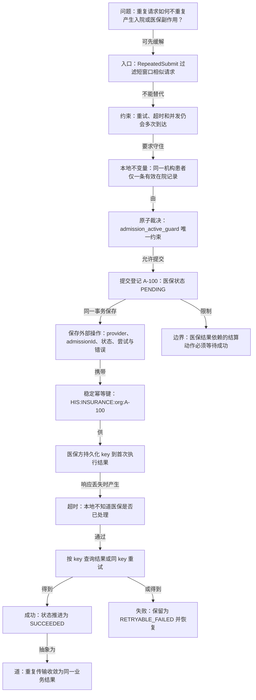

# 场景与知识树

## 场景

工作人员为虚拟患者 `P-001` 创建入院登记 `A-100`，系统还要调用医保系统。响应可能超时，操作可能被重试，并发请求也可能同时到达。目标是在不因医保暂时不可用而阻塞核心入院流程的前提下，防止产生重复的本地或医保登记。

```mermaid
flowchart TD
  Q["问题：重复请求如何不重复产生入院或医保副作用？"]
  R["入口：RepeatedSubmit 过滤短窗口相似请求"]
  N["约束：重试、超时和并发仍会多次到达"]
  G["本地不变量：同一机构患者仅一条有效在院记录"]
  U["原子裁决：admission_active_guard 唯一约束"]
  A["提交登记 A-100：医保状态 PENDING"]
  O["保存外部操作：provider、admissionId、状态、尝试与错误"]
  K["稳定幂等键：HIS:INSURANCE:org:A-100"]
  I["医保方持久化 key 到首次执行结果"]
  T["超时：本地不知道医保是否已处理"]
  C["按 key 查询结果或同 key 重试"]
  S["成功：状态推进为 SUCCEEDED"]
  F["失败：保留为 RETRYABLE_FAILED 并恢复"]
  B["边界：医保结果依赖的结算动作必须等待成功"]
  D["道：重复传输收敛为同一业务结果"]

  Q -->|"可先缓解"| R
  R -->|"不能替代"| N
  N -->|"要求守住"| G
  G -->|"由"| U
  U -->|"允许提交"| A
  A -->|"同一事务保存"| O
  O -->|"携带"| K
  K -->|"供"| I
  I -->|"响应丢失时产生"| T
  T -->|"通过"| C
  C -->|"得到"| S
  C -->|"或得到"| F
  A -->|"限制"| B
  S -->|"抽象为"| D
```
