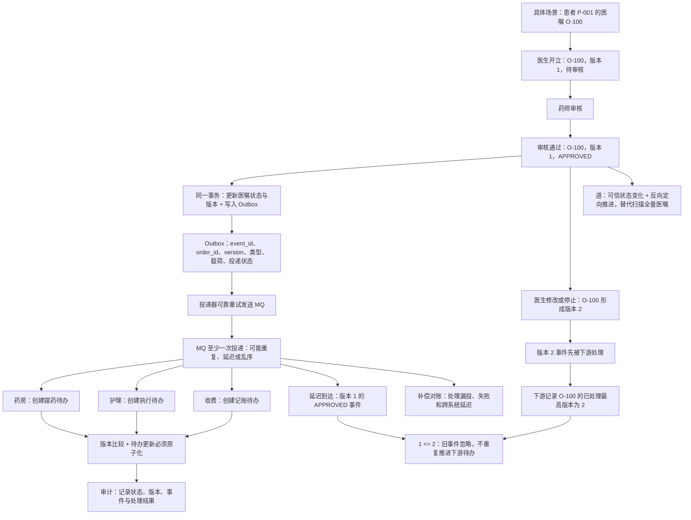

# 场景与知识树

## 场景

患者 `P-001` 住院期间，医生开立虚拟医嘱 `O-100`。药师审核通过版本 1 后，系统需要创建药房摆药、护理执行和费用记账待办。随后医嘱可能被修改或停止，形成更高版本；早先事件也可能因为重试或网络延迟而晚到。

目标不是临床决策，而是保证下游业务不会漏建、重复创建，或被旧版本事件错误覆盖。

```mermaid
flowchart TD
  SC["具体场景：患者 P-001 的医嘱 O-100"]
  DRAFT["医生开立：O-100，版本 1，待审核"]
  REVIEW["药师审核"]
  AP["审核通过：O-100，版本 1，APPROVED"]
  TX["同一事务：更新医嘱状态与版本 + 写入 Outbox"]
  OB["Outbox：event_id、order_id、version、类型、载荷、投递状态"]
  SEND["投递器可靠重试发送 MQ"]
  MQ["MQ 至少一次投递：可能重复、延迟或乱序"]
  PHARM["药房：创建摆药待办"]
  NURSE["护理：创建执行待办"]
  BILL["收费：创建记账待办"]
  CHANGE["医生修改或停止：O-100 形成版本 2"]
  V2["版本 2 事件先被下游处理"]
  CUR["下游记录 O-100 的已处理最高版本为 2"]
  V1LATE["延迟到达：版本 1 的 APPROVED 事件"]
  IGNORE["1 <= 2：旧事件忽略，不重复推进下游待办"]
  ATOMIC["版本比较 + 待办更新必须原子化"]
  AUDIT["审计：记录状态、版本、事件与处理结果"]
  RECON["补偿对账：处理漏投、失败和跨系统延迟"]
  DAO["道：可信状态变化 + 反向定向推进，替代扫描全量医嘱"]

  SC --> DRAFT
  DRAFT --> REVIEW
  REVIEW --> AP
  AP --> TX
  TX --> OB
  OB --> SEND
  SEND --> MQ
  MQ --> PHARM
  MQ --> NURSE
  MQ --> BILL
  AP --> CHANGE
  CHANGE --> V2
  V2 --> CUR
  MQ --> V1LATE
  V1LATE --> IGNORE
  CUR --> IGNORE
  PHARM --> ATOMIC
  NURSE --> ATOMIC
  BILL --> ATOMIC
  ATOMIC --> AUDIT
  MQ --> RECON
  AP --> DAO
```
