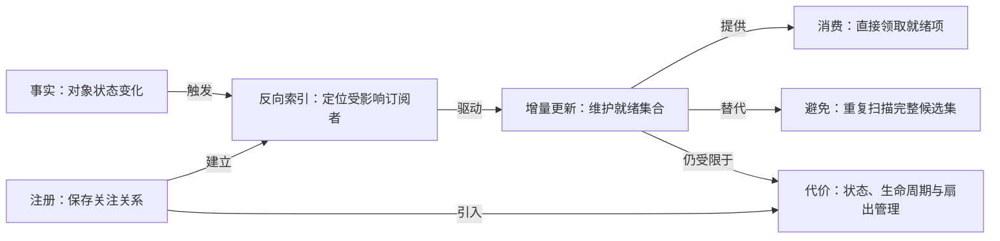

# 道：增量状态驱动的定向推进

## 从 epoll 中剥离出的规律

`epoll` 不是这条道本身。它只是 Linux 在网络 I/O 场景下的一种实现。

这条道是：

> 当候选对象很多、真正受影响的对象很少，并且同一判断会被反复执行时，预先保存“谁关心谁”的反向关系；在状态变化发生时，只推进真实受影响者，并维护可直接消费的结果集合。它以持久状态和一致性复杂度，交换反复全量扫描的成本。

## 它为什么成立

设候选集合大小为 `N`，一次变化真正影响的对象数为 `K`。

```text
轮询模型：每次判断扫描 N 个候选项，哪怕只有 K 项有变化。
增量模型：变化发生时，通过反向索引定位 K 个受影响项，只更新它们。
```

当 `N` 很大、`K` 通常很小、判断频繁发生时，反复支付 `N` 的成本会主导系统；把部分工作前移到“注册关系”和“状态变化”两个时刻，通常更划算。

这不是魔法：增量模型没有消灭工作，只是将无关对象的工作剔除，并将必要工作移动到最接近事实变化的时刻。

## 因果模型

| 层次 | 内容 |
| --- | --- |
| 目标 | 不为未变化、无关的候选项反复付出判断成本。 |
| 前提 | 对象状态存在明确变化事件；订阅关系可保存；变化影响的对象可以被定位。 |
| 结构 | 关注集合、对象到订阅者的反向索引、去重后的就绪集合、对象身份与生命周期状态。 |
| 机制 | 注册时建立关联；状态变化时沿关联定向更新；满足条件的对象入就绪集合；消费者直接领取就绪项。 |
| 收益 | 从重复扫描候选全集，转向处理真实受影响集合。 |
| 代价 | 内存占用、注册/删除成本、状态一致性、对象关闭清理、重复事件抑制与扇出。 |



## 可检验的预测

若一个系统真正应用了这条道，应能观察到以下现象：

1. 在相同输入下，增量实现与全量扫描实现产生相同的可执行/就绪结果。
2. 单次状态变化时，增量实现的主要处理量接近受影响者数量 `K`，而不是候选总量 `N`。
3. 当 `K` 接近 `N`，或状态变化极其频繁时，增量实现的优势会缩小，维护关系的成本可能反而不划算。
4. 一个对象被许多订阅者关注时，处理量会随订阅者数量增长；反向索引避免全局扫描，但不能消除真实扇出。

这些预测让“道”可以被项目、指标和反例验证，而不是停留在口号。

## 反例与边界

不要机械套用这条道。

| 场景 | 为什么未必适用 |
| --- | --- |
| `N` 很小 | 全量扫描足够简单，持久状态的复杂度没有回报。 |
| `K` 经常接近 `N` | 大多数对象每次都受影响，定向更新无法显著减少工作。 |
| 无可信的状态变化事件 | 仍只能周期性检查，不能假装存在事件驱动。 |
| 订阅关系变化极快 | 注册、删除和一致性维护成本可能超过扫描成本。 |
| 正确性优先且状态难以同步 | 需要先解决幂等、顺序、丢失事件和生命周期，再谈性能。 |

`epoll` 的具体边界包括：业务处理阻塞、连接内存、真实网络 I/O、惊群，以及一个 socket 对多个 epoll 的通知扇出。它解决的是反复扫描空闲连接，不是所有高并发问题。

## 迁移不是类比表面，而是映射结构

| 模型角色 | epoll | 依赖驱动任务调度器 |
| --- | --- | --- |
| 候选对象 | socket | 等待执行的任务 |
| 事实变化 | socket 变得可读/可写 | 前置任务完成、配额释放、工具恢复 |
| 反向索引 | socket 到相关 epoll 的等待关联 | 前置任务到后继任务的依赖图 |
| 就绪集合 | epoll ready list | 可执行任务队列 |
| 消费者 | `epoll_wait` 的应用线程 | worker |
| 扇出边界 | 一个 socket 被很多 epoll 关注 | 一个上游任务有很多后继任务 |

两者共同的因果结构是：**变化发生 -> 找到相关者 -> 增量更新 -> 消费已就绪结果**。

## 设计前的四个问题

在新问题上使用这条道前，必须能回答：

1. 候选全集是什么？`N` 有多大？
2. 哪个事实变化会使对象从“不满足”变成“满足”？这个变化是否可靠可观测？
3. 如何从变化对象直接找到受影响者，而不扫描全集？
4. 谁负责处理重复、丢失、关闭、取消、重试和高扇出？

若第 2 或第 3 问没有明确答案，就还没有资格设计“事件驱动”系统；应先保留轮询，或补足状态与索引基础设施。

## 下一步：用项目证伪或支持它

项目不从“写调度器”开始，而从一个可测命题开始：

> 在 `N = 100,000`、每次只有少数任务的依赖状态变化时，依赖图加就绪队列的调度器，在保持结果正确的前提下，检查的任务数应显著少于每次扫描全部任务的基线。

该项目将同时实现增量模型与全量扫描基线，记录候选数、受影响数、扫描次数和就绪队列长度。只有结果符合上述预测，才算为这条道提供了当前场景下的证据。
