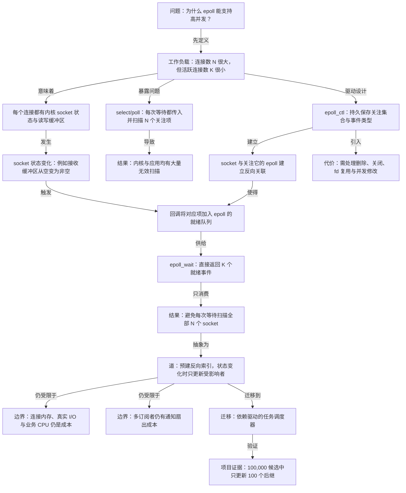

# 为什么 epoll 能支持高并发

## 结论

`epoll` 在大量连接、少量活跃连接的负载下，通过持久关注关系与就绪队列，避免每次等待都扫描全部 socket。它优化无效扫描，但不消除真实 I/O、业务执行或通知扇出成本。

## 关键辨析

- `select/poll` 并非不知道 socket 状态；其接口没有长期保存调用者的关注关系与独立就绪队列，因此一次调用通常要处理完整的 N 项集合。
- socket 建立 TCP 连接后不会自动加入某个 epoll。应用通过 `epoll_ctl` 显式登记关注的 socket 与事件。
- 一个 socket 被许多 epoll 关注时，无需扫描所有 epoll 的关注树，但仍须通知实际订阅它的每个 epoll。这是必要的扇出工作。
