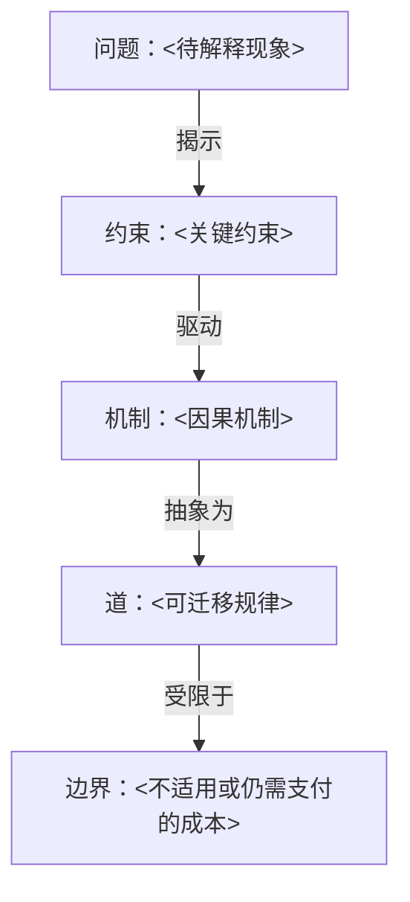

# <主题>

## 术

<具体技术、规则或结论>

## 知识树

## 道

<用“当...时，系统倾向于...，因为...，代价是...”描述>

## 迁移

| 源模型 | 新场景 |
| --- | --- |
| 对象 | <映射> |
| 状态变化 | <映射> |
| 索引/订阅 | <映射> |
| 就绪结果 | <映射> |

## 实战项目

<项目链接、假设、验收证据与剩余问题>
